# VlcCamp
En VlcCamp nos encargamos de la gestión y coordinación de todas las inscripciones para los campamentos de la Comunidad Valenciana. Nuestro objetivo es facilitar un acceso sencillo y ágil a cada uno de los campamentos disponibles, evitando trámites complicados.

Somos conscientes de la importancia que tiene para las familias encontrar la opción que mejor se adapte a sus necesidades. Por ello, hemos desarrollado una plataforma intuitiva que guía paso a paso el proceso de inscripción, garantizando comodidad y eficiencia.

Con VlcCamp, el proceso de inscripción es seguro, transparente y rápido.

# Requisitos

## Gestión de usuarios

En nuestra página web inicial, tenemos un botón donde podemos iniciar sesión. En este botón podrán iniciar sesión las siguientes personas:
- Monitores
- Padres

Por un lado, los momitores serán los encargados de colgar fotos, información, videos, etc... De las actividades realizadas en el campamento. Luego, por otro lado, los padres podrán ver dicha información colgada a modo de red social.

## Requisitos no funcionales

- Interfaz clara y responsive.
- Cifrado de contraseñas y validación de formularios.
- Sistema de alto rendimiento
- Compatible con navegadores modernos y dispositivos moviles.
- Escalabilidad, posibilidad de añadir nuevos campamentos y funcionalidades en el futuro.

## Entrevista con ...

¿Qué busca con esta aplicación? → Facilitar a familias y colegios la búsqueda y reserva de campamentos infantiles.

¿Qué funcionalidades son imprescindibles? → Catálogo claro y reservas online.

¿Quiénes serán los principales usuarios? → Familias con hijos y colegios.

¿Qué problemas quieren evitar? → Procesos manuales de reservas, saturación de llamadas telefónicas y pérdida de información.

# Propuesta
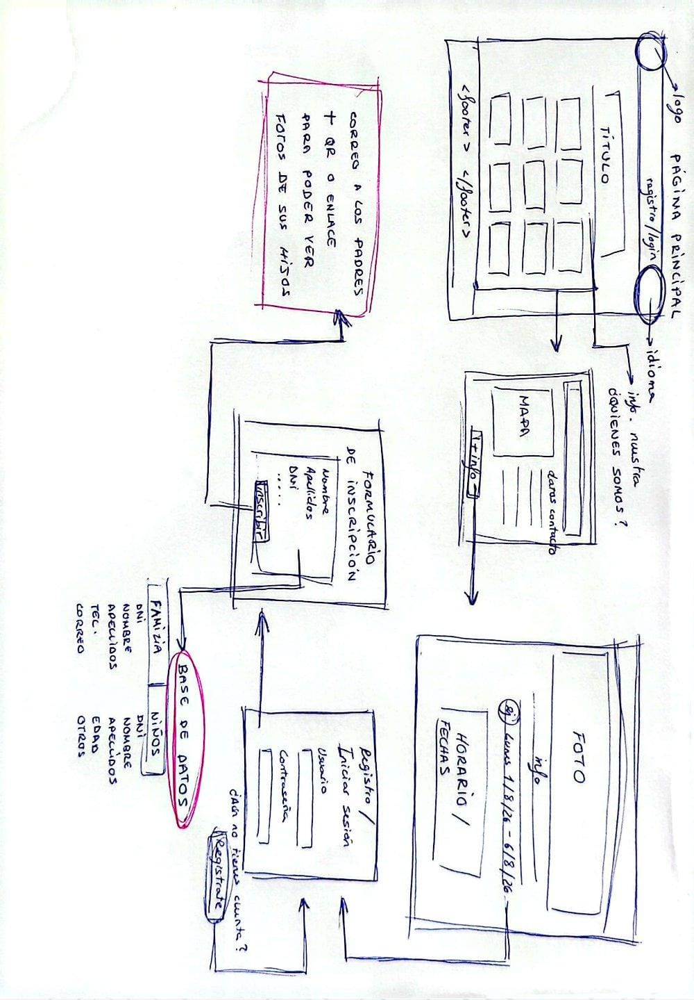

# Mapa de navegación

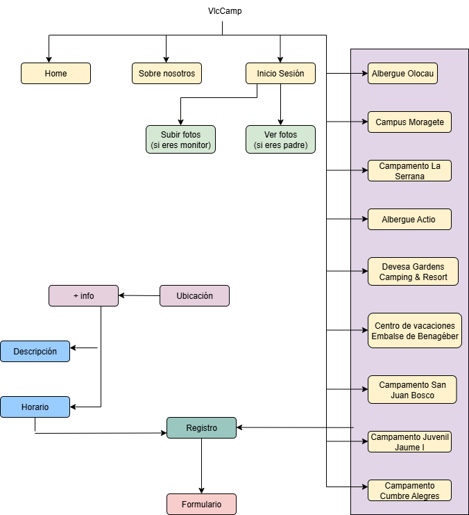

# Prototipo de Figma

Enlace al prototipo de móvil: https://www.figma.com/proto/XMqgzuWBg2S19xbsDGbOCy/Proyecto?node-id=221-1588&t=quyk3KLtDdKv9P6h-1

Enlace al prototipo de escritorio: https://www.figma.com/proto/XMqgzuWBg2S19xbsDGbOCy/Proyecto?page-id=0%3A1&node-id=1912&viewport=414%2C240%2C0.32&t=RbwfNc04QjxXuMfg-1&scaling=scale-down&content-scaling=fixed&starting-point-node-id=19%3A12

En los dos casos, al entrar a la web, encontramos una pantalla de inicio en la que se exponen los diferentes campamentos con los que VlcCamp trabaja. Podemos seleccionar cualquier campamento, y podemos ver mas información del mismo, siendo necesario identificarse con usuario y contraseña, o creando una nueva cuenta en caso de no tener aún.

Dentro de cada página de los campamentos, tenemos la posibilidad de seleccionar un rango de fechas en las que se puede hacer una reserva en dicho campamentos. Después, se redirigirá a un formulario en el que se rellenarán los datos necesarios para la reserva. Al terminar, enviaremos el formulario y se nos mostrará un resumen de los datos.
Además de esto, contamos con una pantalla en la que podemos ver información sobre nuestra cuenta y buscar y añadir nuestros campamentos favoritos. 

## 🖥️ Explicación de Frames — Versión Escritorio

> En esta sección encontrarás las distintas pantallas que componen la versión de escritorio.

---

### 🏕️ Pantalla de inicio  

  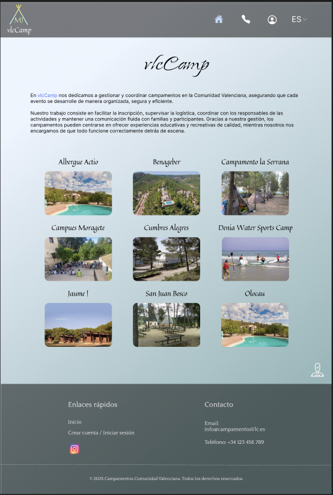

En esta pantalla encontramos la **presentación principal** junto con la lista de campamentos con los que trabajamos.

---

### ℹ️ Información del campamento  

  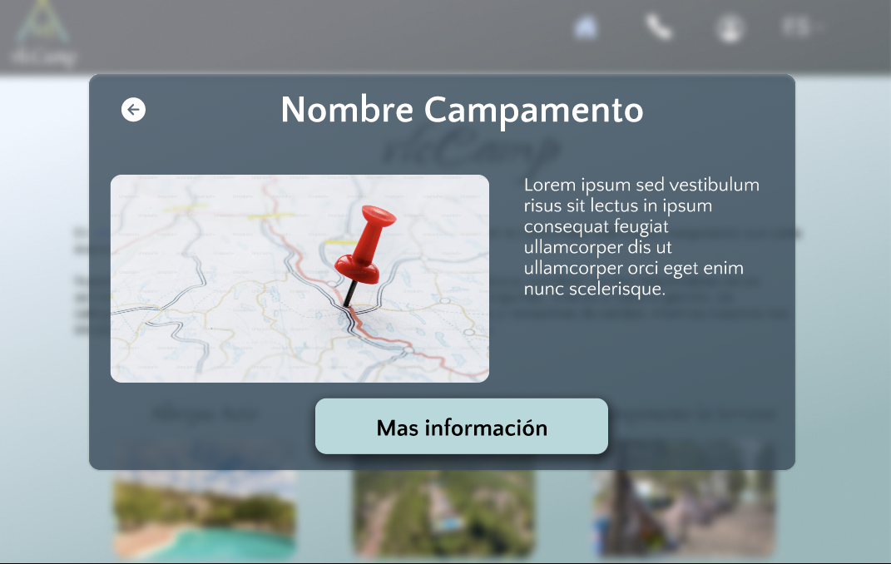

Aquí vemos una **superposición con información detallada** sobre cada campamento y un botón que lleva a su sitio web.

---

### 🔐 Iniciar sesión  

  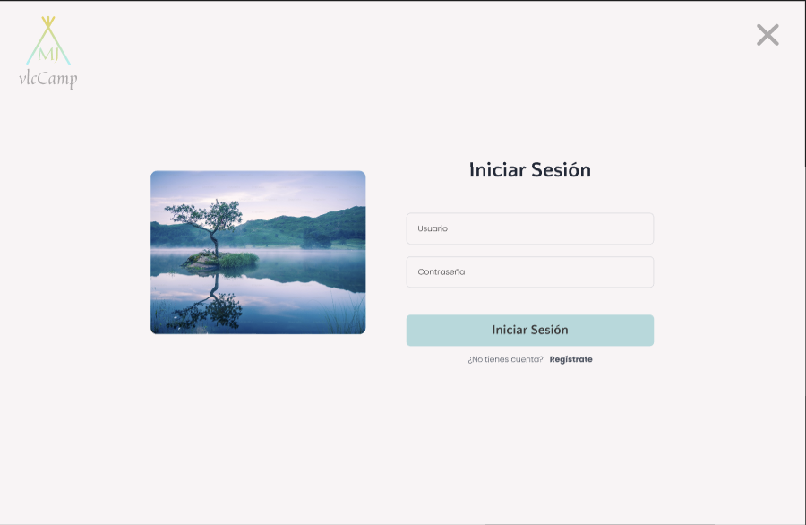

Pantalla de **inicio de sesión básica** para acceder a la web.

---

### 📝 Registro de cuenta  

  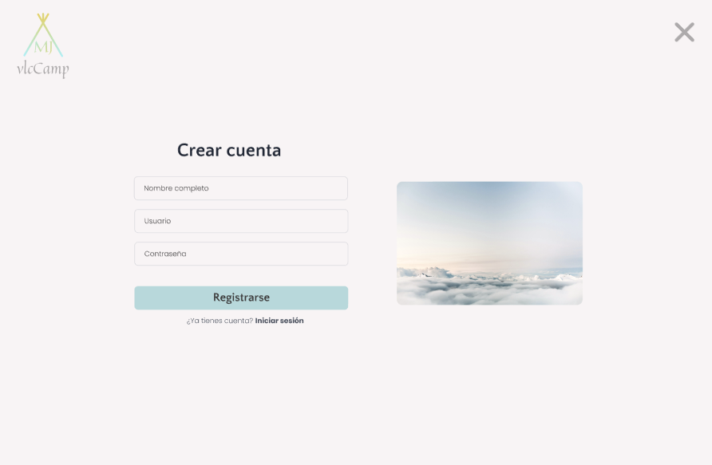

Formulario de **registro básico** para crear una cuenta y acceder al sitio.

---

### ✅ Verificación  

  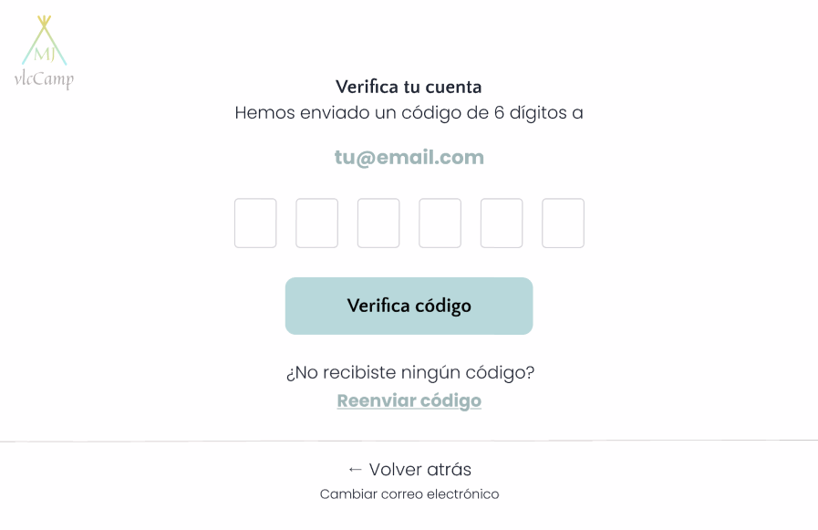

Función de **verificación de cuenta registrada**.

---

### 🏡 Página del albergue  

  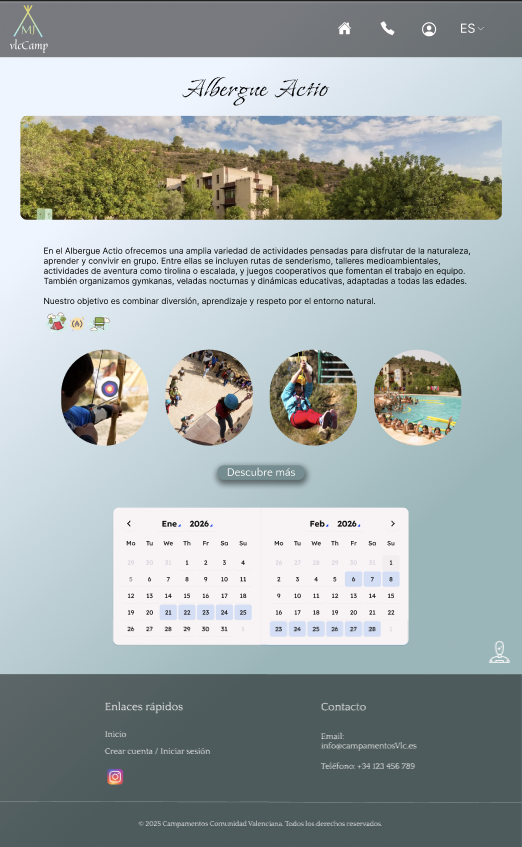

Muestra **información detallada** sobre el albergue o campamento seleccionado.

---

### 📄 Formulario de reserva  

  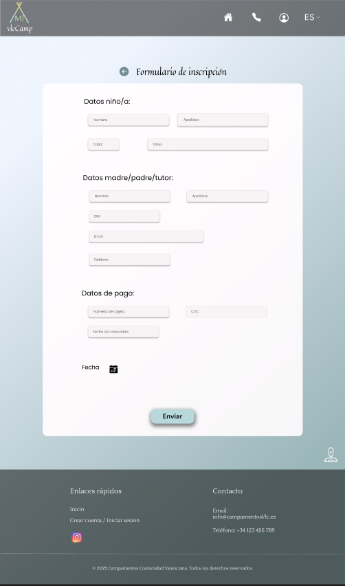

Formulario para **registrar una reserva** en el campamento elegido.

---

### 📋 Resumen del formulario  

  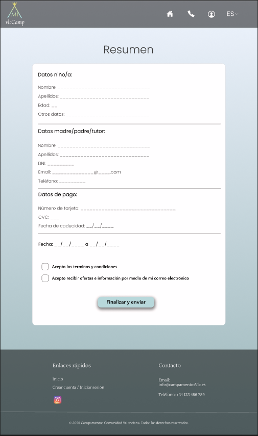

Pantalla que muestra un **resumen del formulario completado**.

---

### 👤 Mi cuenta  

  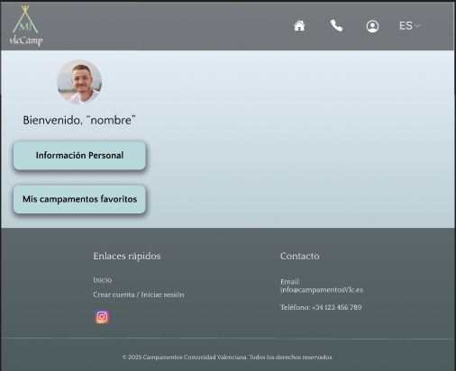

Sección donde se muestra **información general de la cuenta del usuario**.

---

### 🧾 Información personal  

  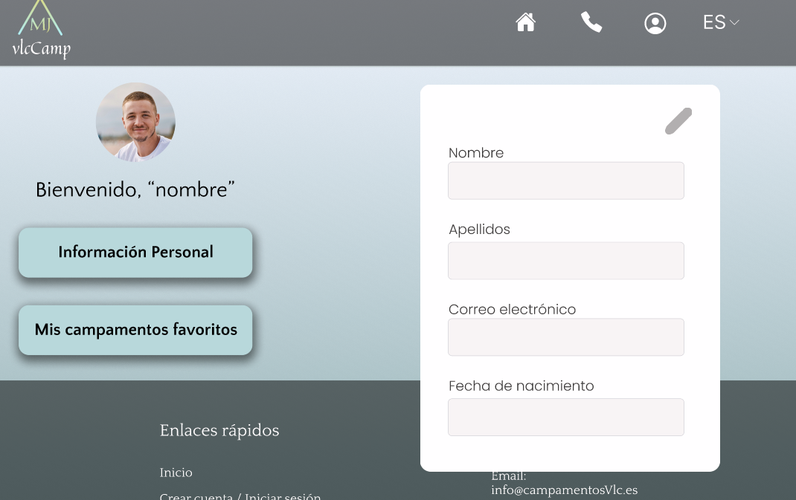

Pantalla con los **datos personales del usuario**.

---

### ⭐ Campamentos favoritos  

  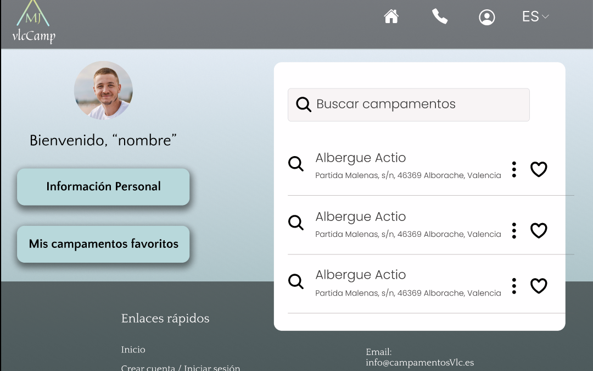

Lista de **campamentos favoritos**, donde el usuario puede añadir o gestionar los suyos.

---

## 📱 Explicación de Frames — Versión Móvil

> A continuación, se muestran las pantallas adaptadas para la versión móvil del sitio.

---

### 🏕️ Pantalla de inicio  

  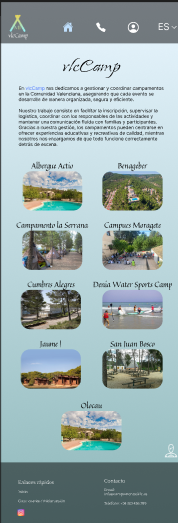

Página inicial con una breve **presentación** y los diferentes campamentos disponibles.

---

### 📍 Ubicación del campamento  

  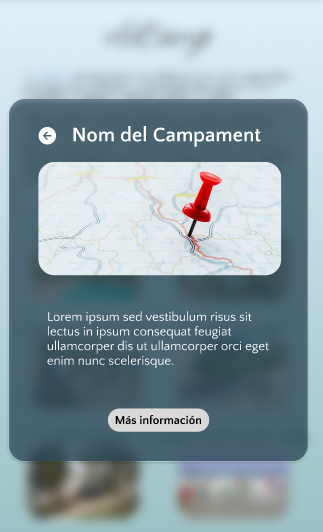

Superposición que **muestra la ubicación** del campamento seleccionado.

---

### ℹ️ Más información  

  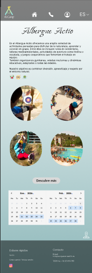

Muestra **más información** del campamento y un **calendario interactivo** para elegir fechas.

---

### 📝 Formulario de inscripción  

  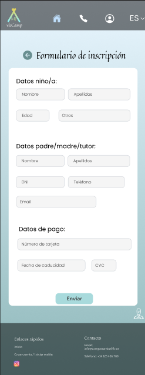

Formulario para **inscribir a los hijos** en el campamento deseado.

---

### 📋 Resumen  

  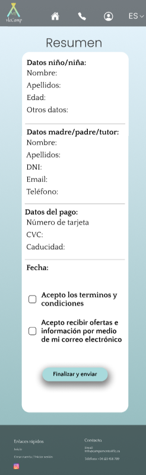

Resumen de la **información completada en el formulario**.

---

### 👤 Cuenta de usuario  

  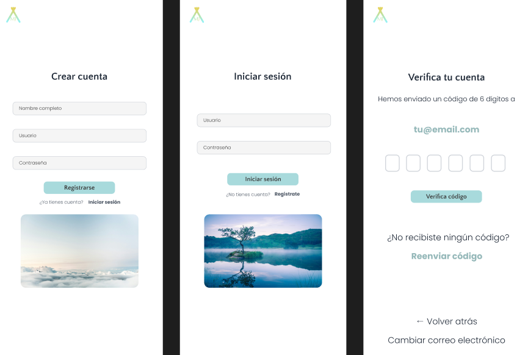

Es necesario **crear una cuenta o iniciar sesión** en caso de que ya exista una.

---

### ⚙️ Información de la cuenta  

  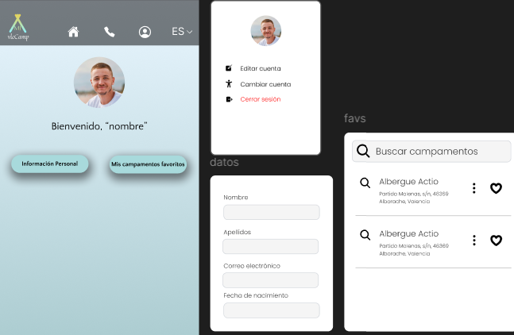

Ventana con opciones para **editar los datos de la cuenta**, **añadir favoritos** y **visualizar campamentos guardados**.

---
