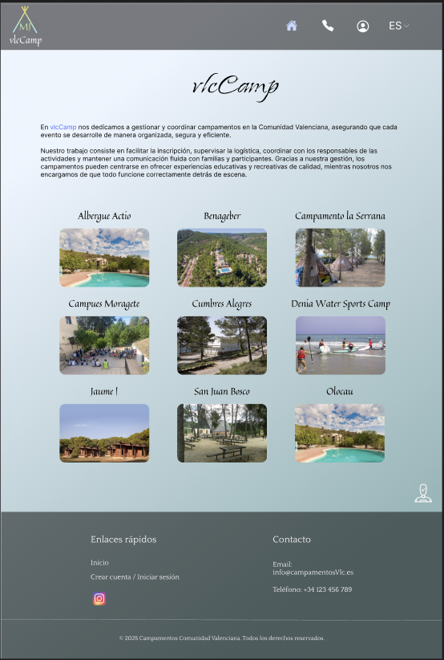
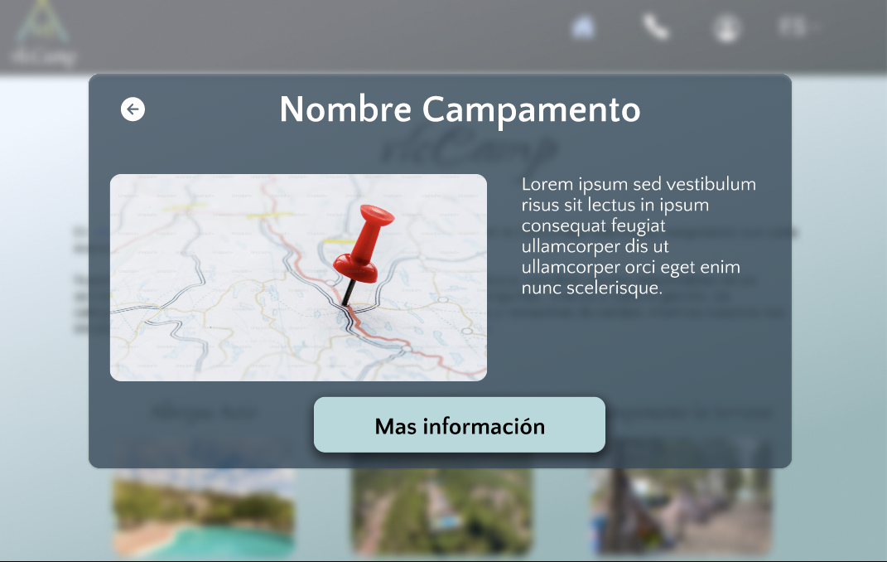
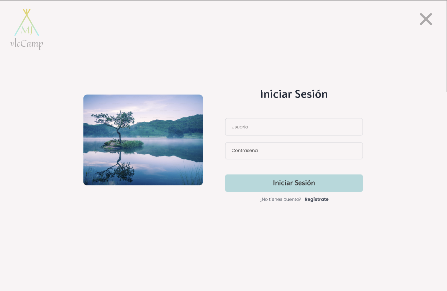
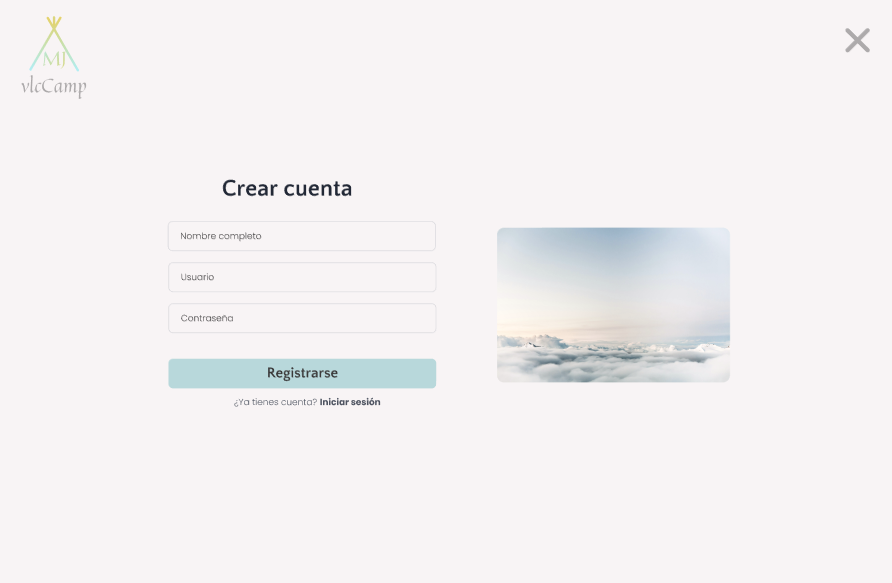
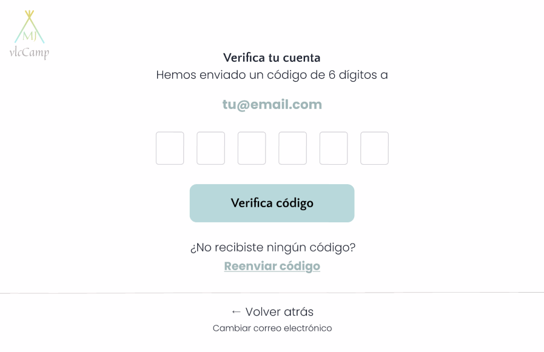
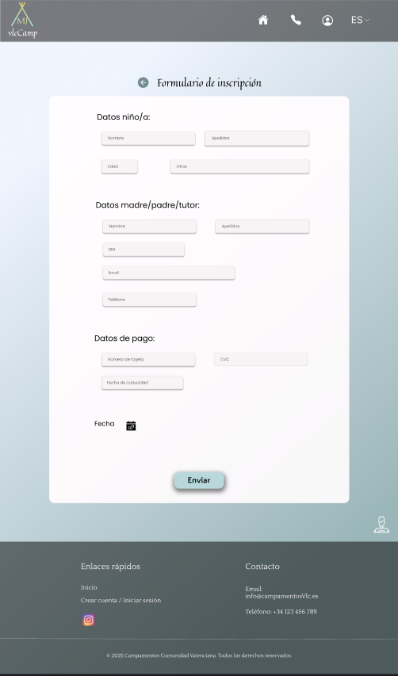
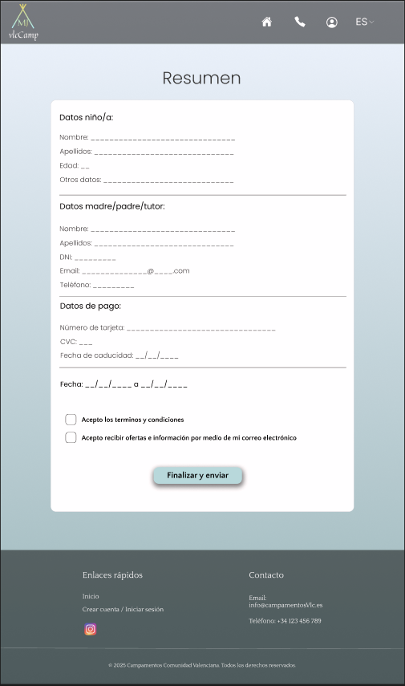
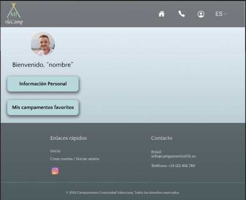

# VlcCamp
En VlcCamp nos encargamos de la gestión y coordinación de todas las inscripciones para los campamentos de la Comunidad Valenciana. Nuestro objetivo es facilitar un acceso sencillo y ágil a cada uno de los campamentos disponibles, evitando trámites complicados.

Somos conscientes de la importancia que tiene para las familias encontrar la opción que mejor se adapte a sus necesidades. Por ello, hemos desarrollado una plataforma intuitiva que guía paso a paso el proceso de inscripción, garantizando comodidad y eficiencia.

Con VlcCamp, el proceso de inscripción es seguro, transparente y rápido.

# Requisitos

## Gestión de usuarios

En nuestra página web inicial, tenemos un botón donde podemos iniciar sesión. En este botón podrán iniciar sesión las siguientes personas:
- Monitores
- Padres

Por un lado, los momitores serán los encargados de colgar fotos, información, videos, etc... De las actividades realizadas en el campamento. Luego, por otro lado, los padres podrán ver dicha información colgada a modo de red social.

## Requisitos no funcionales

- Interfaz clara y responsive.
- Cifrado de contraseñas y validación de formularios.
- Sistema de alto rendimiento
- Compatible con navegadores modernos y dispositivos moviles.
- Escalabilidad, posibilidad de añadir nuevos campamentos y funcionalidades en el futuro.

## Entrevista con ...

¿Qué busca con esta aplicación? → Facilitar a familias y colegios la búsqueda y reserva de campamentos infantiles.

¿Qué funcionalidades son imprescindibles? → Catálogo claro y reservas online.

¿Quiénes serán los principales usuarios? → Familias con hijos y colegios.

¿Qué problemas quieren evitar? → Procesos manuales de reservas, saturación de llamadas telefónicas y pérdida de información.

# Propuesta

# Mapa de navegación

# Prototipo de Figma

Enlace al prototipo de móvil: https://www.figma.com/proto/XMqgzuWBg2S19xbsDGbOCy/Proyecto?page-id=221%3A1588&node-id=2211667&viewport=-1231%2C178%2C0.73&t=2OT9z584wsvE2C7e-1&scaling=scale-down&content-scaling=fixed&starting-point-node-id=221%3A1667

Enlace al prototipo de escritorio: https://www.figma.com/proto/XMqgzuWBg2S19xbsDGbOCy/Proyecto?page-id=0%3A1&node-id=1912&viewport=414%2C240%2C0.32&t=RbwfNc04QjxXuMfg-1&scaling=scale-down&content-scaling=fixed&starting-point-node-id=19%3A12

En los dos casos, al entrar a la web, encontramos una pantalla de inicio en la que se exponen los diferentes campamentos con los que VlcCamp trabaja. Podemos seleccionar cualquier campamento, y podemos ver mas información del mismo, siendo necesario identificarse con usuario y contraseña, o creando una nueva cuenta en caso de no tener aún.

Dentro de cada página de los campamentos, tenemos la posibilidad de seleccionar un rango de fechas en las que se puede hacer una reserva en dicho campamentos. Después, se redirigirá a un formulario en el que se rellenarán los datos necesarios para la reserva. Al terminar, enviaremos el formulario y se nos mostrará un resumen de los datos.
Además de esto, contamos con una pantalla en la que podemos ver información sobre nuestra cuenta y buscar y añadir nuestros campamentos favoritos. 

## Explicacion de frames

### Inicio

En esta pantalla, encontramos nuestra presentación junto con la lista de campamentos con los que trabajamos.

 
En esta superposición, vemos mas información sobre dicho campamento, teniendo un botón que te llevará a la web de dicho campamento.

 
Inicio de sesión básico para poder acceder a la web.

 
Registro básico para poder acceder a la web

 
Función en la que se verifica la cuenta registrada

 
Esta sería la web del albergue.

 
Formulario para poder registrar una reserva

 
Resumen de dicho formualrio.

 
Pantalla en la que aparece información sobre mi cuenta. 

 
Información personal sobre mi cuenta

 
En esta pantalla tenemos el listado de los campamentos y podemos añadirlos a favoritos. 
